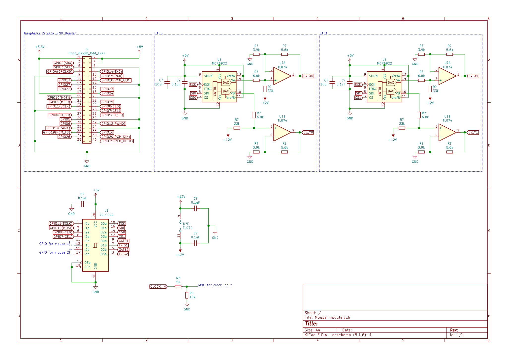

# MouseModule

This is an eurorack module that processes mouse events through the [Raspberry Pi Zero](https://www.raspberrypi.org/documentation/hardware/raspberrypi/spi/README.md) and [MCP4922](http://ww1.microchip.com/downloads/en/DeviceDoc/22250A.pdf) and outputs 2 CV signals (for the X and Y coordinates) a `GATE` signal (controlled by the left button) and a `TRIGGER` signal (controlled by the right button). It has also recording and playback capabilities with more complex mice.  

## Hardware

2 mice version

1 mouse version

  
